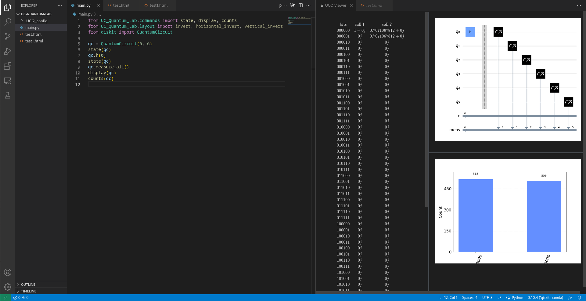

# uc-quantum-lab

This extension provides a UI that allows the results of quantum circuit simulated with qiskit to be presented cleanly. This extension operates with the required python library https://github.com/brodkemd/UCQ_tools.

NOTE: If you want a feature or you find a bug create an issue.

## Features
Can display a lot of information about your circuit including:
- The statevector of your circuit an arbitrary number of times from anywhere in your circuit as long as there is no measurements.
- An image of your circuit an arbitrary number of times from anywhere in your circuit.
- A histogram resprenting the results of the execution of your circuit an arbitrary number of times.

> Tip: Many popular extensions utilize animations. This is an excellent way to show off your extension! We recommend short, focused animations that are easy to follow.

## Requirements
- Python and pip on your device, NOTE: we strongly recommend using anaconda for this (see https://www.anaconda.com/) and it must be installed as user not as root (this is the better way to do it anyway)

## Extension Commands
For example:

This extension contributes the following commands:

* `uc-quantum-lab.execute`: execute the extension, will detect if the directory is initialize or not and initialize it if need be. It will also open up a webview panel where it will display content.
* `uc-quantum-lab.init`: setup the current workspace path for this extension.
* `uc-quantum-lab.reinit`: if you encounter an error try running this, it will wipe the extension setup in workspace and setup it up again.

## Known Issues

Do not know any currently but there is more than likely some because of  being in beta.

## Release Notes

### 0.0.1
Works on windows and linux relatively well, need to test on mac os.
